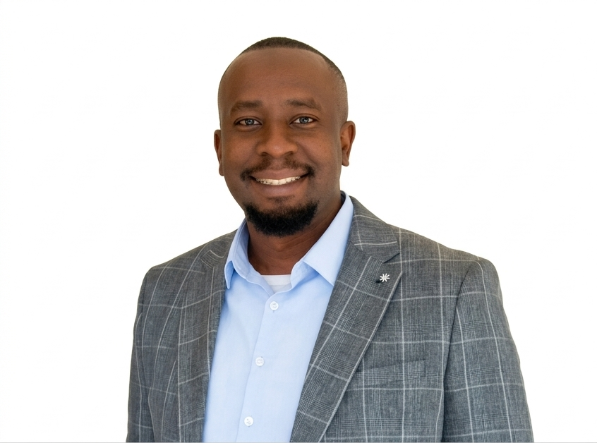

{fig-alt="Portrait of Matthew Kuch" width="240" .rounded-circle .float-md-end .ms-md-4 .mb-3}

I have spent the last decade working on global health — at the
[Clinton Health Access Initiative](https://www.clintonhealthaccess.org) in
Uganda and Lesotho, at [Gavi, the Vaccine Alliance](https://www.gavi.org) in
Geneva managing country portfolios across Kenya and Lesotho, and at Deloitte
Consulting before that, managing grants for USAID and DFID.

I have sat in hundreds of meetings where budgets were being allocated, programmes
were being designed, and decisions were being made that affected hundreds of
thousands of lives. Most of what I write starts in one of those rooms, with a
question I could not answer from the numbers in front of me.

Today I work as a partner and strategic advisor through my consulting practice,
supporting governments, donors and implementers on strategy, programme delivery
and performance management. Recent work includes an HPV vaccine scale-up
strategy in Papua New Guinea, a polio vaccine management and last-mile delivery
strategy with UNICEF, and grants and portfolio financial management with Gavi.

## What I write about

**Health financing.** How countries pay for health, what happens when donor
money arrives or leaves, and why domestic revenue is the part of the equation
that actually determines whether a system survives.

**Global health.** Immunisation, maternal and newborn survival, and the delivery
problems that sit between a proven intervention and a person who needs it.

**Political economy.** Why sensible policies fail, why incentives beat
intentions, and what game theory explains about corruption, elections and public
spending.

**Data visualisation.** I build interactive data stories in R, D3 and Svelte,
because some arguments only become obvious when you can see them.

**Supply chain management.** Vaccine logistics, last-mile delivery and the
unglamorous operational detail that decides whether a programme works.

## Background

I hold an MSc in International Development and Management from Lund University,
read Accounting and Finance at the London School of Economics, and did my BA in
Physics and Economics at Wheaton College in Massachusetts. I was a United World
Colleges scholar and a Davis scholar.

I live in Uganda with my family.

## Get in touch

The best ways to reach me are [email](mailto:kuch.matthew@gmail.com) and
[LinkedIn](https://www.linkedin.com/in/matthew-k-ab0134122/). My code is on
[GitHub](https://github.com/mattykuch), and my [CV](cv.qmd) has the full detail.
