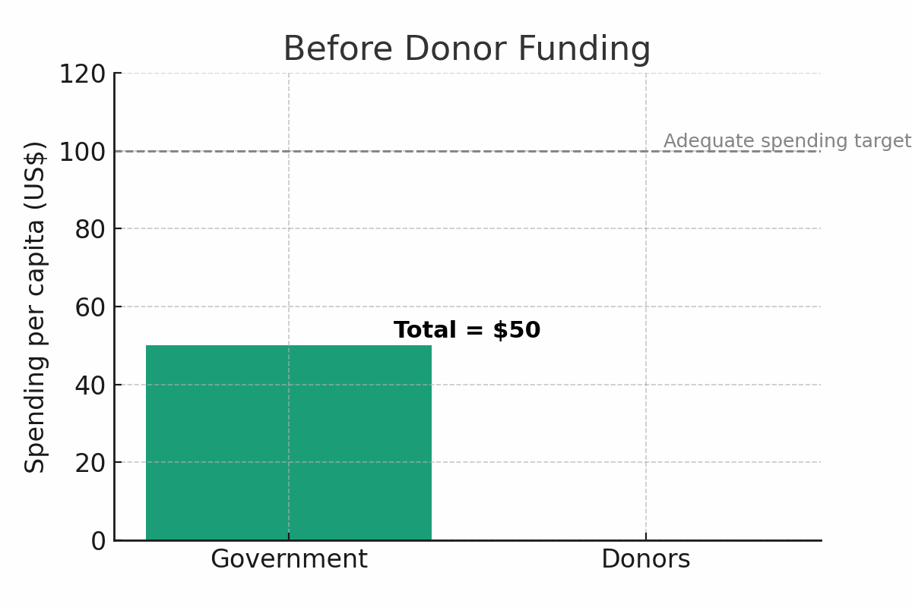

### **The Math is not "Math-ing"**

Would you believe me if I told you that, when it comes to public health spending, in Africa; "1 + 1" is NOT equal to "2" ?

Crazy assertion, I know. But let me explain what I mean by that.

The phenomenon I've described above is known as the "displacement effect",

where an increase is funding to public health from external donors, leads to the government spending less on public health. It works something like this:

1.  **Let's say the total needed** for adequate health spending **per person per year is \$100**, in African Country X.

2.  **The government typically, on average, spends \$50 per person** on public health per year (wishful thinking, know. But play along)

3.  **Then the donors arrive and offer to spend an additional \$30 per person** on public health programs (what donors call, "catalytic investments" to ignite the government to spend even more on health and meet the targeted \$100 per person

4.  **But the government says, “Great! We’ll reduce our initial \$50 to \$10** per person, now that we’ve got a whole \$30 covered by donors.”

The Result? The health funding gap remains. Instead of an increase in domestic funding, there's backsliding.

One study (IHME 2013) quantified this phenomena further to say that:

> For every \$1 a donor spends on public health in Africa, the government reduces its own health spending by up to \$1.14.

Let that sink in, for a moment.

Like I said, "1 + 1" is NOT equal to "2". The Math is not "Math-ing".

Its kind of like if your child received a partial scholarship as a contribution to their school fees, for say good performance, but instead of stepping up as a parent and paying the balance - you instead stop paying school fees altogether and use the money you had to buy the new iPhone.

It makes no sense, I know. But that's how our governments actually operate.

### **Misaligned Incentives**

At the core of this "displacement effect" is something very common in society - misaligned incentives. Because at the end of the day, governments are run by humans not robots. And humans respond to incentives.

Hence, when our leaders know that donors will keep funding public health, they will move that previously earmarked domestic funding for health, elsewhere e.g. To areas that that will win them votes in the next election cycle and secure their power.

### **So what can we do to align incentives?**

Obviously the fix isn't to just get rid of donors, which is like throwing the baby out with the bath water.

Instead, we need to change how donors give in 3 key ways:

1.  Tie external donor funding to domestic co-financing efforts

2.  Avoid siloed funding and prioritize system-wide support

3.  Country ownership through a single-plan that donors plug into

### **1 Tie external donor funding to domestic co-financing efforts**

Essentially, donors need to say, "We'll give you \$1, but only if you spend \$1 too".

Organizations like [**Gavi, the Vaccine Alliance**](https://www.linkedin.com/company/gavi/) and others have been doing this for decades, and it works because instead of displacing domestic health spending, you incentive more of it by rewarding shared funding commitments - as part of a co-financing model.

### **2 Avoid siloed funding and prioritize system-wide support**

To date, most donor funding tends to go into targeted vertical programs i.e. disease or population - specific programs (think HIV, Malaria, Immunization, etc...) that are mostly easy to measure and market.

But the problem is: That's how you end up with health centers which can test for HIV and Malaria, but have no Panadol and no toilets for patients.

Hence, its important to take an integrated and health system wide approach to funding - that thinks of the health sector as an ecosystem of interconnected parts, because if we only fund the "marketable and sexy" parts, the whole thing will eventually collapse - like a house of cards.

### **3 Country ownership through a single coordinated plan that donors plug into**

You can have all the resources (both financial and otherwise) in the world, but if you cannot coordinate and direct them towards impactful goals, then they're useless. That's actually (come to think of it) a key African problem, even beyond public health.

That's why countries like Rwanda, that have managed to successfully implement donor coordination mechanisms are great role models of best-in-class examples of how public health programs financing should be done in Africa. Fundamentally, their system works like this:

1.  The Rwandan Ministry of Health develops and costs their National Health Sector Strategic Plan based on sector-wide stakeholder consultations - particularly from the lower administrative units and community/village networks

2.  They then use this single strategic plan as a resource mobilization tool by sharing it with donors for alignment

3.  Donors then plug-into this single plan to close any funding gaps, based on shared priorities with the government

That's the definition of country ownership. The Rwanda case is unique, not because other African countries haven't tried similar coordination models - its unique because Rwanda's approach is bottom-up and includes intensive consultation from communities and local governments, before its taken-up for central government and donor funding

------------------------------------------------------------------------

When our government partners-up financially with donors the logical expectation is that their combined investments should increase the overall pool of resources available to enhance the public good i.e. "1 + 1" should be equal to "2"

But for many years that has not been the case in many African countries because of the displacement effect and other factors (which I'll touch on in subsequent posts).

Hence, its imperative that we change this dynamic , going forward, through some of the ways I've proposed above, if we ever want to see real and sustained impact on the ground. I'll leave you with the words of [**Baroness Dambisa Moyo**](https://www.linkedin.com/in/dambisamoyo/) :

> No country has ever achieved economic success by depending on aid to the degree that many African countries do

------------------------------------------------------------------------

### **References**

-   Gavi, the Vaccine Alliance, 2023. *Co-financing policy*. Available at: [**https://www.gavi.org/programmes-impact/programmatic-policies/co-financing-policy**](https://www.gavi.org/programmes-impact/programmatic-policies/co-financing-policy) \[Accessed 10 August 2025\].

-   World Health Organization, 2024. *Global Health Expenditure Database (GHED)*. Geneva: WHO. Available at: [**https://apps.who.int/nha/database**](https://apps.who.int/nha/database) \[Accessed 10 August 2025\]

-   IHME, 2013. Global Health Metrics & Evaluation Conference on Health Financing. Seattle, WA: Institute for Health Metrics and Evaluation. Available at: [**https://youtu.be/c1Jlz9_TbMc?si=eygh-5LBbO8wUa-u**](https://youtu.be/c1Jlz9_TbMc?si=eygh-5LBbO8wUa-u) \[Accessed 10 August 2025\]

-   Parfait Uwaliraye et al., 2024. Rwanda’s Single Project Implementation Unit: An Effective Donor Coordination Platform in the Journey to Achieving Universal Health Coverage. *Health Systems and Reforms*, Vol. 10. Issue 3. Perspectives on implementing objective-oriented health reforms. Available at: [**https://www.tandfonline.com/doi/full/10.1080/23288604.2024.2403527#abstract**](https://www.tandfonline.com/doi/full/10.1080/23288604.2024.2403527#abstract) \[Accessed 10 August 2025\]
