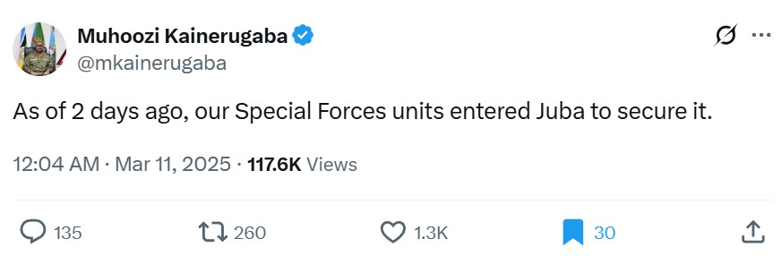
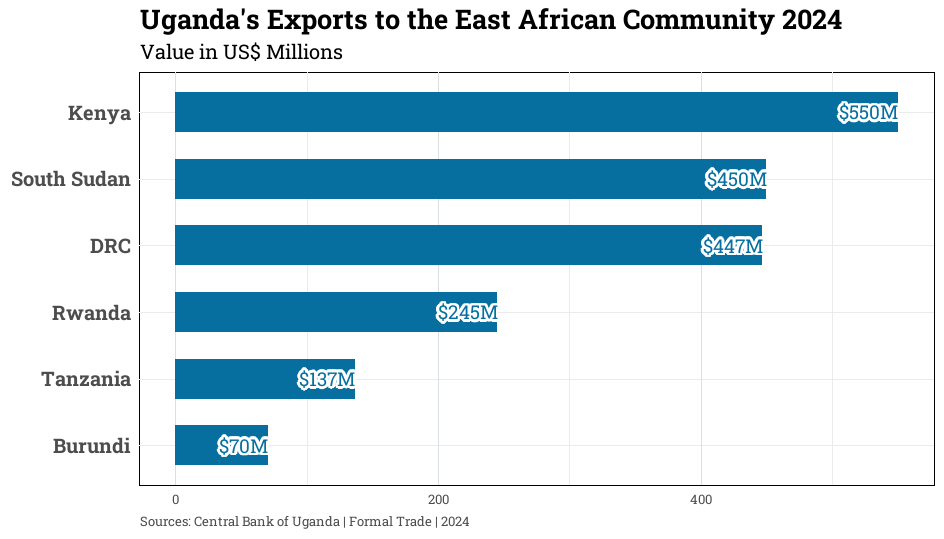
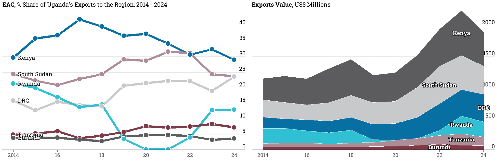

On March 9, 2025, Uganda quietly deployed troops to Juba, the capital of South Sudan. No big press release. No formal announcement. Just soldiers and a military convoy crossing a border under a sky that looked the same as it always has.

Two days later, Muhoozi Kainerugaba, Uganda’s top military officer, broke the silence on X (formerly Twitter):

No further context. Just that one key word -*"secure".*

Which begs the question: Secure what, exactly?

In geopolitics, you rarely send elite troops somewhere just to *be* there and chill. You send them because something valuable might slip away. And in East Africa, few things are more valuable than a reliable trading partner.

South Sudan is fragile state. Always has been, since its independence. But it’s also Uganda’s **second-largest export market in the East African region**, an economic fact that matters alot. 

Uganda exports to South Sudan the kinds of things that a young country needs to grow: building materials, household goods, processed food, medicine. That trade isn’t just business for Uganda, it’s an economic lifeblood for thousands of Ugandan businesses and jobs.

There’s a iron-rule that applies across countries, businesses, and families:

**You protect what you benefit from,** and Uganda benefits (economically, socially and politically) from South Sudan being stable.

In the days and weeks leading up to the deployment, reports trickled in of political infighting in Juba, between the President Salva Kiir and his Vice President, Reich Machar, with hints that the fragile peace might not hold. If that happens, the Nimule-Juba corridor, Uganda’s commercial artery in the West-Nile region, gets severed.

So, the UPDF moved. Not just to keep peace. Not just to look strong. But to keep the trucks moving and the contracts alive.

## References

1.  <https://www.bou.or.ug/bouwebsite/Statistics/index.html>
2.  <https://x.com/mkainerugaba/status/1899204699208724671>
