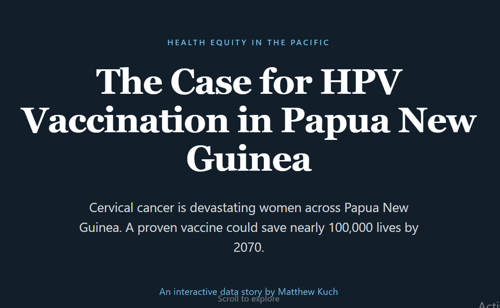
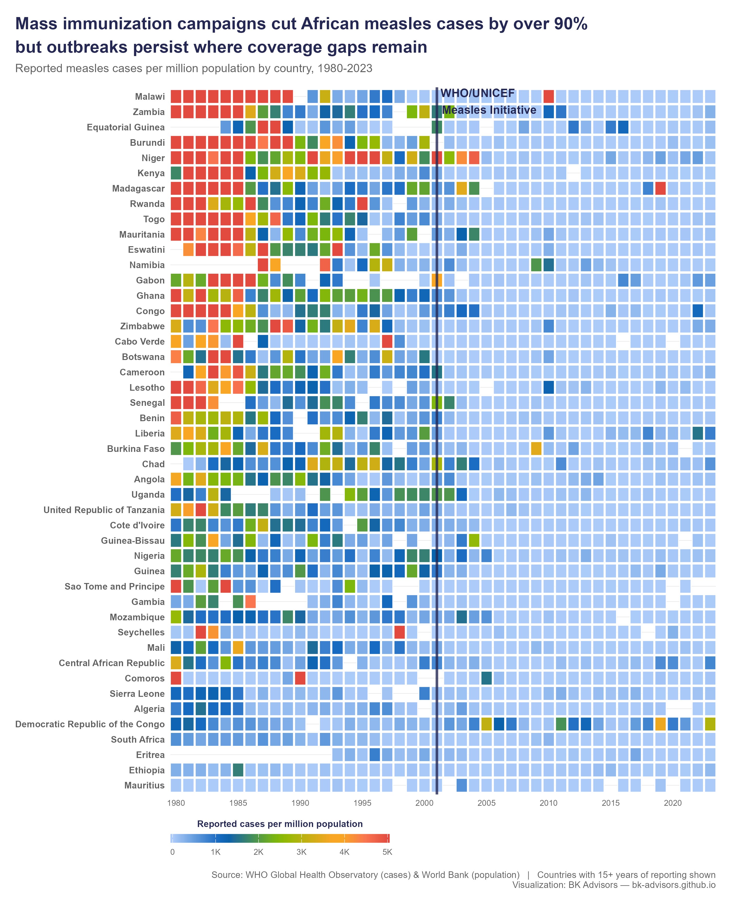
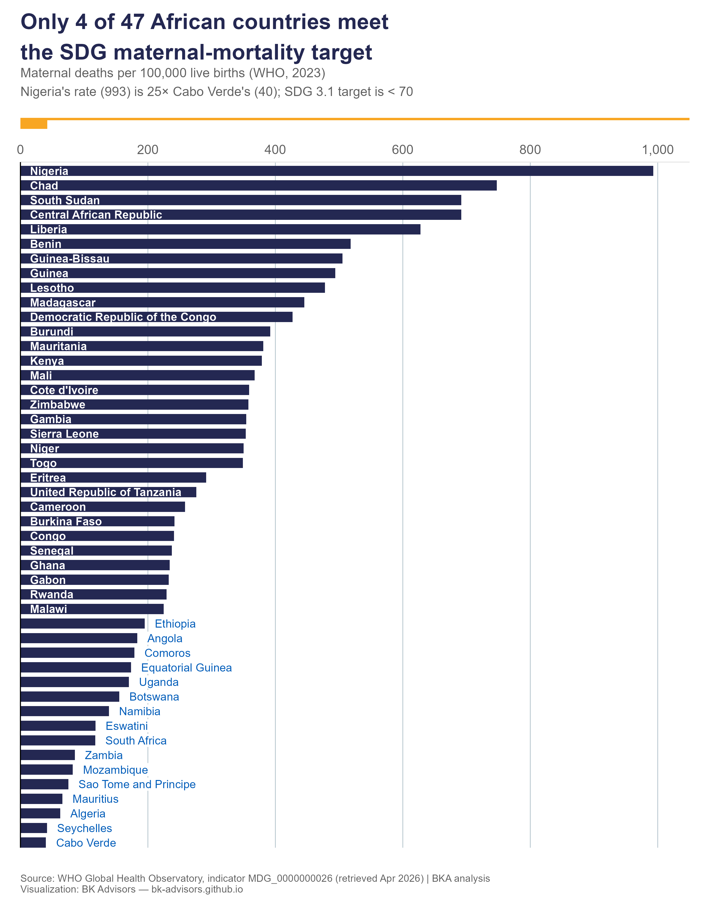

These are the pieces where the argument needed more than prose. Each one is a
standalone interactive story, built in R, D3 or Svelte and hosted separately.

::: {.mk-entry}
::: {.mk-entry__thumb}
[{fig-alt="Cover image for The Case for HPV Vaccination in Papua New Guinea"}](https://bk-advisors.github.io/hpv-png-story/)
:::
::: {.mk-entry__body}
[SCROLLYTELLING · VACCINES]{.mk-entry__meta}

### [The Case for HPV Vaccination in Papua New Guinea](https://bk-advisors.github.io/hpv-png-story/)

A scrollytelling data story making the investment case for HPV vaccination in
PNG, built from a cervical-cancer prevention project I worked on. Cervical
cancer is the country's leading cause of cancer death among women, and almost
entirely preventable.

[Explore the story →](https://bk-advisors.github.io/hpv-png-story/)
:::
:::

::: {.mk-entry}
::: {.mk-entry__thumb}
[{fig-alt="Heatmap of measles incidence across African countries, 1980 to 2024"}](https://bk-advisors.github.io/africa-measles/)
:::
::: {.mk-entry__body}
[INTERACTIVE HEATMAP · 44 YEARS, 46 COUNTRIES]{.mk-entry__meta}

### [Measles in Africa](https://bk-advisors.github.io/africa-measles/)

In 1981 measles infected 1.4 million people across Africa in a single year. By
2016 it was 35,000, a 97% fall. This heatmap lets you watch the red tiles fade
to blue, country by country and year by year. It makes one of the great public
health achievements visible again.

[Explore the chart →](https://bk-advisors.github.io/africa-measles/)
:::
:::

::: {.mk-entry}
::: {.mk-entry__thumb}
[{fig-alt="Interactive chart of maternal mortality ratios across African countries"}](https://bk-advisors.github.io/africa-mmr/)
:::
::: {.mk-entry__body}
[INTERACTIVE CHART · MATERNAL HEALTH]{.mk-entry__meta}

### [Maternal Mortality in Africa](https://bk-advisors.github.io/africa-mmr/)

In 2023 a woman giving birth in Nigeria was 25 times more likely to die than one
giving birth in Cabo Verde. Only 4 of 47 African countries meet the SDG 3.1
target. This chart makes the gap impossible to look away from.

[Explore the chart →](https://bk-advisors.github.io/africa-mmr/)
:::
:::

::: {.mk-entry}
::: {.mk-entry__body}
[DATA ESSAY · NEONATAL MORTALITY]{.mk-entry__meta}

### [The Lost Decade](https://bk-advisors.github.io/africa-preterm-births-nmr/)

What a 2023 *Lancet* paper on preterm births tells us about a decade of stalled
progress on newborn survival, and why preterm birth has become the single
largest driver of under-five deaths.

[Read the analysis →](https://bk-advisors.github.io/africa-preterm-births-nmr/)
:::
:::

::: {.mk-entry}
::: {.mk-entry__body}
[VISUAL ESSAY · MORTALITY]{.mk-entry__meta}

### [Causes of Death in Africa](https://bk-advisors.github.io/occupations/apps/africa-causes-of-death-story/)

What Africans actually die of, how that has shifted as infectious disease
mortality has fallen, and why the rise of non-communicable disease is arriving
faster than most health systems are budgeting for.

[Explore the story →](https://bk-advisors.github.io/occupations/apps/africa-causes-of-death-story/)
:::
:::
