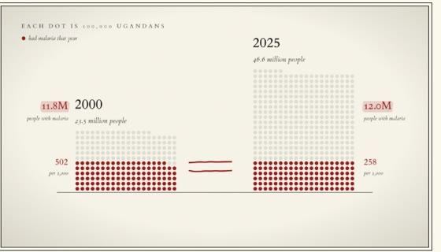
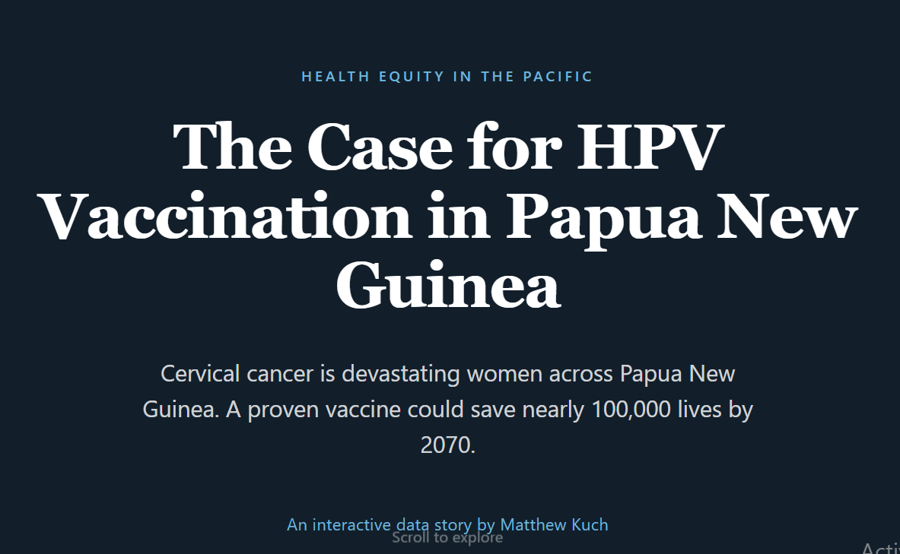
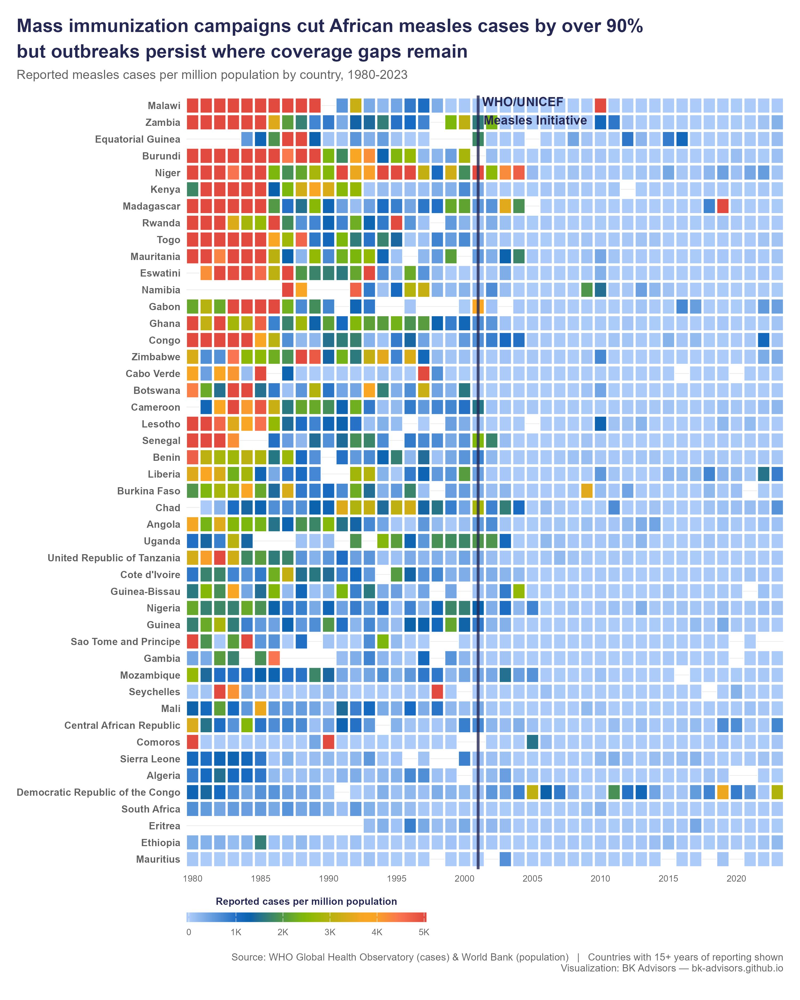
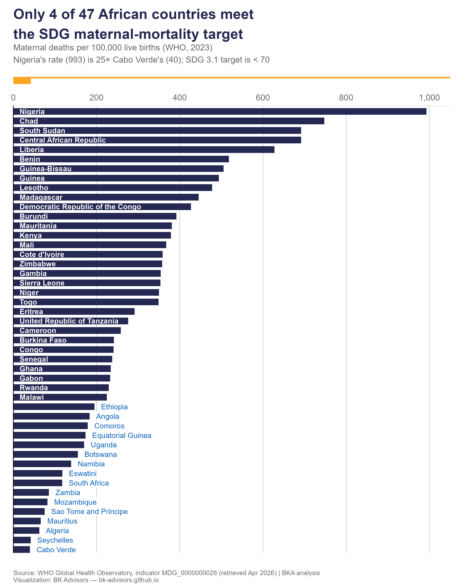
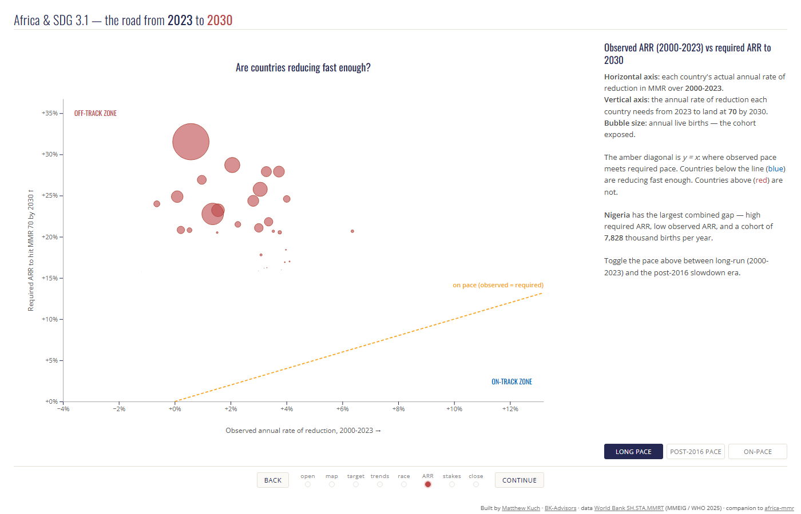
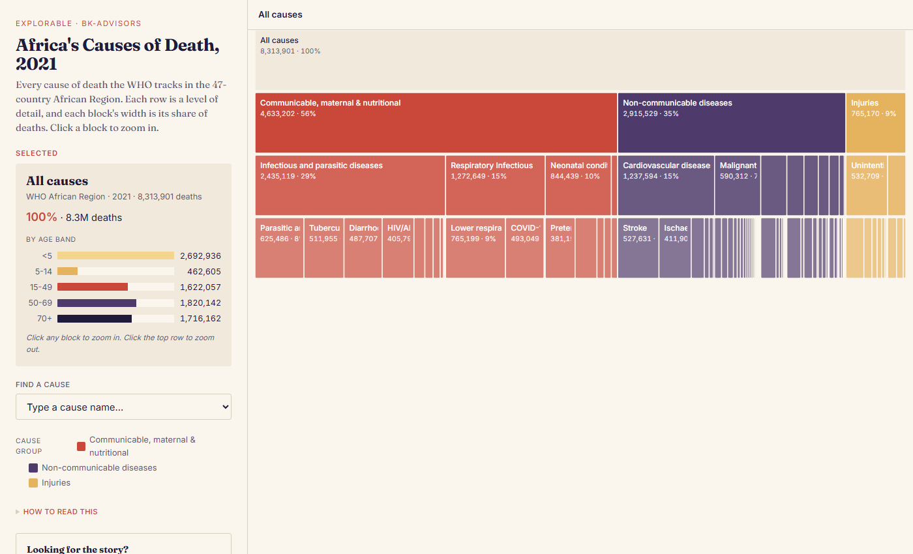

These are the pieces where the argument needed more than prose. Each one is a
standalone interactive story, built in R, D3 or Svelte and hosted separately.

::: {.mk-entry}
::: {.mk-entry__thumb}
[{fig-alt="Dots for Uganda's population in 2000 and 2025, with the people who had malaria in red"}](/lab/malaria-in-uganda/)
:::
::: {.mk-entry__body}
[CLICK-THROUGH STORY · MALARIA · 135 DISTRICTS]{.mk-entry__meta}

### [Malaria in Uganda](/lab/malaria-in-uganda/)

Uganda nearly halved its malaria rate between 2000 and 2025, yet about as many people
fell sick in 2025 as in 2000, because the population doubled. This story walks
through 26 years of data, district by district, and asks who will keep paying
to hold the gains. You can look up your own district.

[Explore the story →](/lab/malaria-in-uganda/)
:::
:::

::: {.mk-entry}
::: {.mk-entry__thumb}
[{fig-alt="Cover image for The Case for HPV Vaccination in Papua New Guinea"}](https://bk-advisors.github.io/hpv-png-story/)
:::
::: {.mk-entry__body}
[SCROLLYTELLING · VACCINES]{.mk-entry__meta}

### [The Case for HPV Vaccination in Papua New Guinea](https://bk-advisors.github.io/hpv-png-story/)

A scrollytelling data story making the investment case for HPV vaccination in
PNG, built from a cervical-cancer prevention project I worked on. Cervical
cancer is the country's leading cause of cancer death among women, and almost
entirely preventable.

[Explore the story →](https://bk-advisors.github.io/hpv-png-story/)
:::
:::

::: {.mk-entry}
::: {.mk-entry__thumb}
[{fig-alt="Heatmap of measles incidence across African countries, 1980 to 2023"}](/lab/africa-measles/)
:::
::: {.mk-entry__body}
[INTERACTIVE HEATMAP · 44 YEARS, 46 COUNTRIES]{.mk-entry__meta}

### [Measles in Africa](/lab/africa-measles/)

In 1981 measles infected 1.4 million people across Africa in a single year. By
2016 it was 35,000, a 97% fall. This heatmap lets you watch the red tiles fade
to blue, country by country and year by year. It makes one of the great public
health achievements visible again.

[Explore the chart →](/lab/africa-measles/)
:::
:::

::: {.mk-entry}
::: {.mk-entry__thumb}
[{fig-alt="Interactive chart of maternal mortality ratios across African countries"}](/lab/africa-mmr/)
:::
::: {.mk-entry__body}
[INTERACTIVE CHART · MATERNAL HEALTH]{.mk-entry__meta}

### [Maternal Mortality in Africa](/lab/africa-mmr/)

In 2023 a woman giving birth in Nigeria was 25 times more likely to die than one
giving birth in Cabo Verde. Only 4 of 47 African countries meet the SDG 3.1
target. This chart makes the gap impossible to look away from.

[Explore the chart →](/lab/africa-mmr/)
:::
:::

::: {.mk-entry}
::: {.mk-entry__thumb}
[{fig-alt="Scatter chart of African countries' observed versus required rate of reduction in maternal mortality, most in the off-track zone"}](/lab/africa-mmr-2030/)
:::
::: {.mk-entry__body}
[CLICK-THROUGH STORY · MATERNAL HEALTH · 54 COUNTRIES]{.mk-entry__meta}

### [Africa and SDG 3.1: The Road to 2030](/lab/africa-mmr-2030/)

The follow-up to the chart above. Of Africa's 54 countries, 10 are on pace to
bring maternal deaths below 70 per 100,000 live births by 2030. At current
rates, roughly 530,000 more mothers will die by 2030 than if every country were
on pace. Watch every country race towards the deadline.

[Explore the story →](/lab/africa-mmr-2030/)
:::
:::

::: {.mk-entry}
::: {.mk-entry__body}
[DATA ESSAY · NEONATAL MORTALITY]{.mk-entry__meta}

### [The Lost Decade](https://bk-advisors.github.io/africa-preterm-births-nmr/)

What a 2023 *Lancet* paper on preterm births tells us about a decade of stalled
progress on newborn survival, and why preterm birth has become the single
largest driver of under-five deaths.

[Read the analysis →](https://bk-advisors.github.io/africa-preterm-births-nmr/)
:::
:::

::: {.mk-entry}
::: {.mk-entry__thumb}
[{fig-alt="Icicle chart of 8.3 million deaths in the WHO African Region in 2021, split by cause group"}](/lab/africa-causes-of-death/)
:::
::: {.mk-entry__body}
[DATA STORY + EXPLORABLE · MORTALITY · 8.3 MILLION DEATHS]{.mk-entry__meta}

### [Causes of Death in Africa](/lab/africa-causes-of-death/)

What 8.3 million deaths across the WHO African Region in 2021 looked like, by
cause and by age band. We organise health attention around outbreaks like
Ebola, while the steady, predictable causes do most of the killing. Read the
story, or poke at every cause the WHO tracks in the explorable version.

[Read the story →](/lab/africa-causes-of-death/) · [Explore the numbers →](/lab/africa-causes-of-death-explore/)
:::
:::
